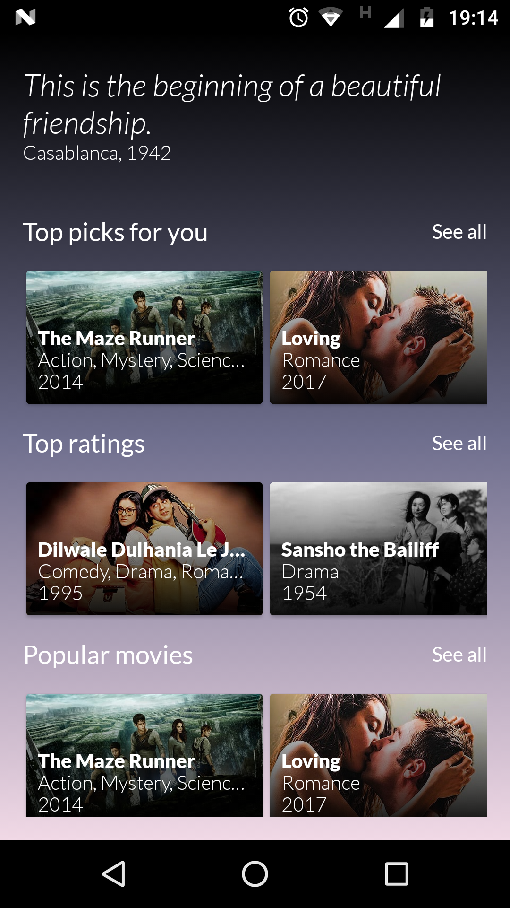
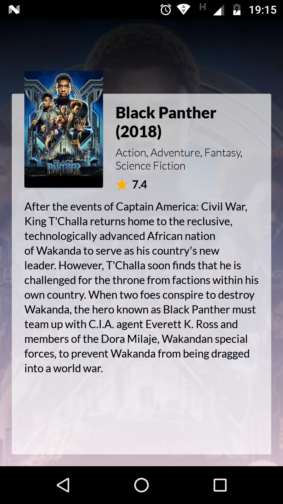
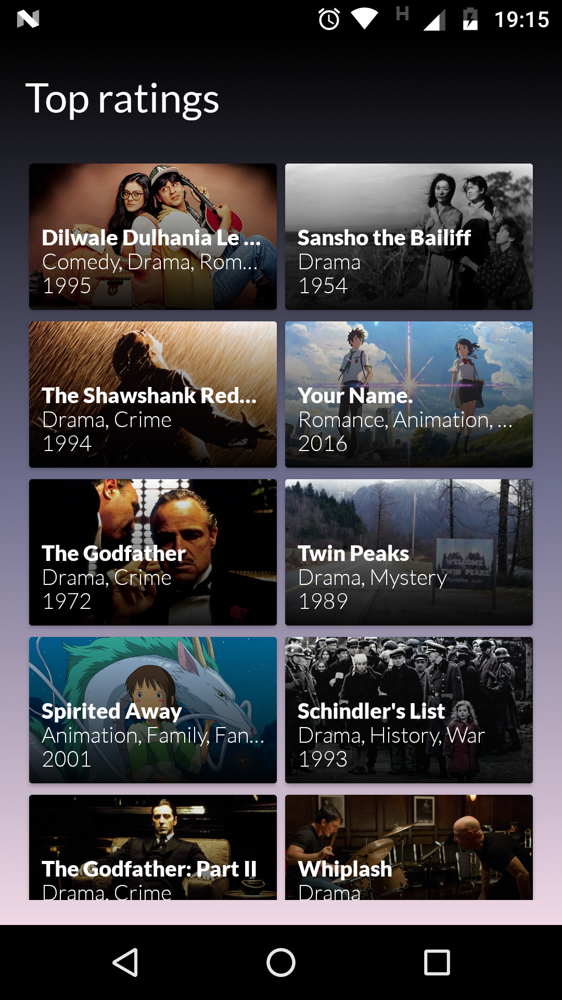

# Movies

An android app that is fed by https://www.themoviedb.org, built with Kotlin using MVVM archtecture.

Dependencies used
--------

- Retrofit -> HTTP requests handling
- Android Architecture Components -> MVVM implementation
- Picasso -> Image downloading and caching
- RxJava/RxAndroid -> Reactive programming

Compilation Requirements
--------
- Android Studio 3.0.1 or newer with build tools sdk at version 27.0.2
